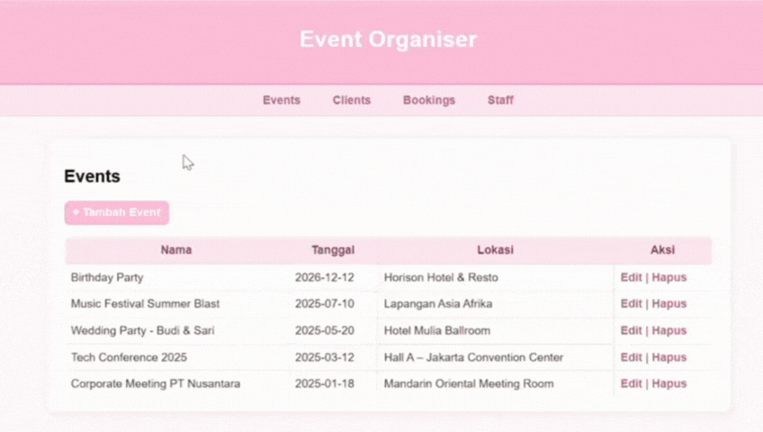
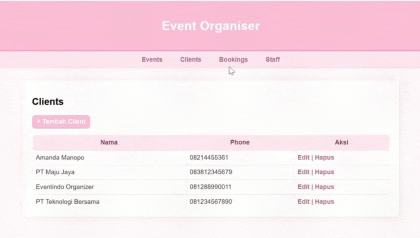
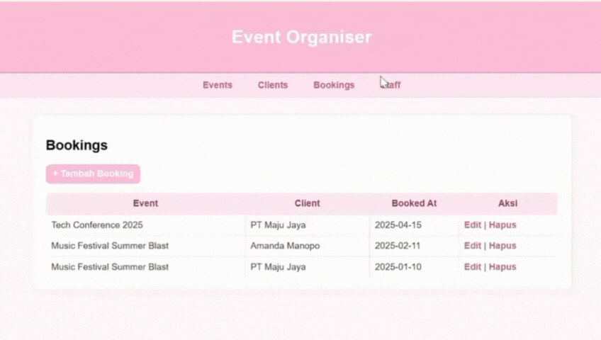

Saya Ervina Kusnanda dengan NIM 2409082 mengerjakan Tugas Praktikum 10 dalam mata kuliah Desain Pemogramana Berorientasi Objek untuk keberkahanNya maka saya tidak melakukan kecurangan seperti yang telah dispesifikasikan. Aamiin

## Desain Tabel (Database Design) ##

Sistem ini menggunakan empat tabel utama, yaitu: clients, events, staffs, dan bookings. Masing-masing tabel memiliki minimal dua atribut, dan terdapat relasi relasional menggunakan primary key – foreign key sesuai ketentuan.

1. Tabel Clients
   Menyimpan data klien yang mendaftar atau memesan event.

   - id, Primary key
   - name,	Nama client
   - phone,	Nomor telepon client

2. Tabel Staff
   Menyimpan informasi karyawan / staf yang menangani acara.

   - id, Primary key
   - name, Nama staf
   - role, Jabatan
   - event_id (FK), (→ events.id)	Relasi event yang ditangani

3. Tabel Events
   Menyimpan informasi kegiatan yang dibuat.

   - id, Primary key
   - name, Nama event
   - date, Tanggal pelaksanaan
   - location, Lokasi event

4. Tabel Booking
   Menyimpan data pemesanan (booking) event oleh client.

   - id, Primary key
   - client_id (FK), (→ clients.id)	Relasi client
   - event_id (FK), (→ events.id)	Relasi event

## Relasi Antar Tabel ##
- Relasi 1: staff.event_id → events.id
  (Satu event bisa punya banyak staf)

- Relasi 2: booking.client_id → clients.id
  (Satu client bisa melakukan banyak booking)

- Relasi 3: booking.event_id → events.id
  (Satu event bisa dibooking oleh banyak client)

 
 ## Desain Program (Struktur MVVM) ##

 Penjelasan umum:
 - models/      = Komunikasi dengan database
 - viewmodels/  = Menangani request form, binding data
 - views/       = Tampilan halaman web
 - template/    = Komponen halaman yang dipakai di semua view
 - index.php    = Routing halaman

 
 1. Model
    Model adalah bagian yang bertanggung jawab untuk interaksi dengan database.
    Fungsi utamanya:
    - Mengambil semua data
    - Mengambil data berdasarkan ID
    - Menambah data (INSERT)
    - Mengubah data (UPDATE)
    - Menghapus data (DELETE)

2. View
   View adalah tampilan HTML + PHP yang digunakan pengguna untuk melihat dan mengelola data melalui browser.
   Di View terdapat:
   - Form tambah dan edit
   - Tabel data
   - Tombol aksi (Edit | Hapus)

3. ViewModel
   ViewModel menghubungkan View dan Model.
   Tugas ViewModel:
   - Menangani request ($_GET dan $_POST)
   - Menjalankan fungsi CRUD di Model
   - Mengirim data ke View

## Alur Program ##
Berikut alur logika program untuk setiap tabel:

1. Alur Clients
   Pengguna masuk halaman Clients. Data clients ditampilkan melalui $vm->clients
   Pengguna dapat: tambah client, edit client, hapus client/
   Data diproses melalui ViewModel → Model → Database

2. Alur Events
   - Pengguna membuka halaman Events
   - Data event ditampilkan dalam tabel
   - Pengguna dapat: tambah, edit, hapus
   - Database menyimpan data melalui CRUD

3. Alur Staff
   Halaman Staff menampilkan list semua staf. Form tambah/edit staf terdapat dropdown event, data binding event.
   Jika form disubmit, ViewModel memanggil fungsi Model untuk INSERT/UPDATE

4. Alur Booking
   Halaman Booking menampilkan list booking lengkap dengan:
   - client name
   - event name
   Form booking memiliki dropdown:
   - client (FK)
   - event (FK)
   Setelah submit, data tersimpan di tabel booking

5. Integritas Data
   - Staff harus memilih event (FK wajib)
   - Booking harus memilih client dan event (FK wajib)

     Sehingga relasi database benar-benar digunakan.

## dokumentasi ##

